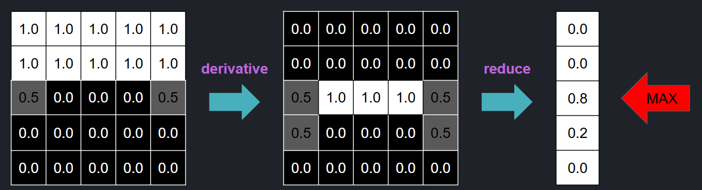
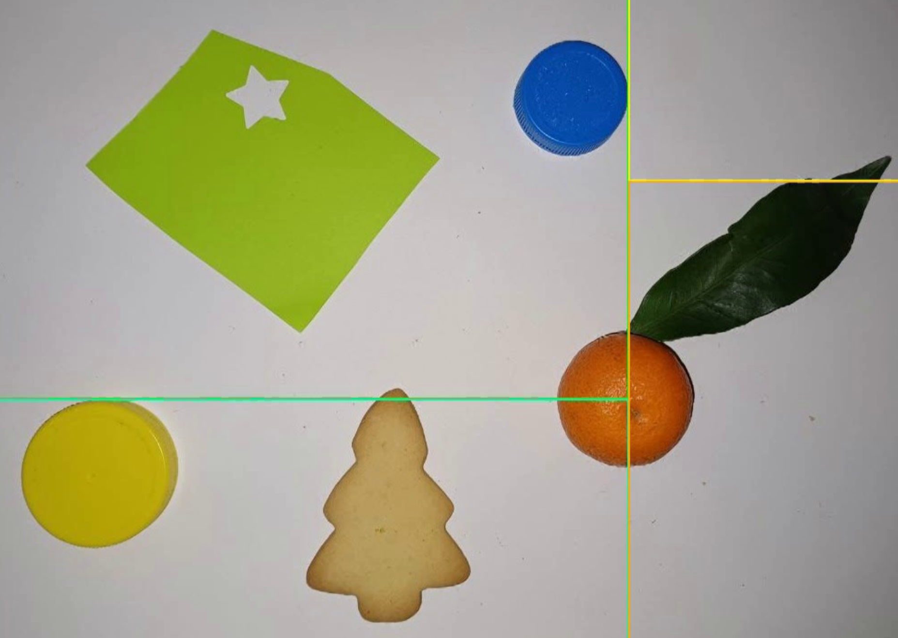

# Report  
This is the detailed report of the project "Asymmetric Split and Merge" by Luca Sartore.

## Objectives  

The main objective of this project is to create a fully functional split-and-merge implementation with a small change to the original algorithm. I aim to allow for "asymmetric" splitting, meaning that when an area is split in half, the two resulting pieces can have any size relative to each other (instead of being forced to be the same size).  

I have also set a few secondary objectives for this project:  
- Make the implementation multithreaded.  
- Ensure the code is as reusable as possible.  
- Evaluate the [opencv-rust](https://github.com/twistedfall/opencv-rust) crate, which provides Rust bindings for OpenCV.  

The choice of Rust was motivated by the language's multithreading-first approach and the fact that I had already used OpenCV extensively in Python and C++ therefore I wanted to try something new.  
(See [Puzzle Solver](https://github.com/lucaSartore/PuzzleSolver) and [RoboCup Junior Robot](https://github.com/lucaSartore/Robocup-Rescue-Line-simulation) for related projects.)  

It is important to note that an in-depth comparison between my version of split-and-merge (with asymmetric splitting) and the traditional one is *not* one of the objectives of this project. This is because I collaborated with another student who is implementing the traditional version of split-and-merge and will provide the comparison. However, I have still included two small examples where the differences between the algorithms can be observed.  


## High-Level Code Overview  

To maximize code reusability, I have split the logic into several traits (Rust's version of interfaces).  
In particular, I have defined a `Splitter` trait, a `Merger` trait, and a `Logger` trait for different aspects of the implementation:  
- The `Splitter` trait handles the splitting logic.  
- The `Merger` trait defines the merging logic.  
- The `Logger` trait is used to generate animations, debug outputs, or integration testing logs.  

### Splitter Trait  

The `Splitter` trait is defined as a single function that takes a non-mutable reference to an image as input and performs calculations to determine whether the area needs to be split.  

- If no splitting is needed, the function should return `None`.  
- Otherwise, the function should return a split direction (`x` or `y` axis) and an `i32` value (the relative coordinate of the split).  

```rust
pub trait SplitterTrait: Sync + 'static {
    fn split(&self, image: &Mat) -> Option<(CutDirection, i32)>;
}
```  

### Merger Trait  

The `Merger` trait is even simpler. It takes two binary masks and an image as input and returns a boolean value.  

- The image must be the original colored image.  
- The two masks identify the areas to be merged.  
- The function returns `true` if the areas can be merged and `false` otherwise.  

```rust
pub trait MergerTrait: Sync + 'static {
    fn merge(&self, mask_a: &Mat, mask_b: &Mat, image: &Mat) -> bool;
}
```  

### Logger Trait  

As the name implies, the `Logger` trait is responsible for logging actions. It is used to:  
- Generate videos for demonstration.  
- Debug the algorithm.  
- Support automated integration tests.  

```rust
pub trait LoggerTrait {
    fn log_split(&mut self, area_to_split_id: usize, splits: [Area; 2]) -> Result<()>;
    fn log_merge(&mut self, new_item_id: usize, to_merge: [usize; 2]) -> Result<()>;
    fn finalize_log(&mut self) -> Result<()>;
}
```  

### Main Logic  

The main logic, not covered by the traits, is encapsulated in the `MainLogic` struct. This is a generic struct with four parameters: `S`, `M`, `L`, and `ST`.  

- The first three parameters represent implementations of the traits described above (`SplitterTrait`, `MergerTrait`, and `LoggerTrait`). This design ensures that the main logic is reusable with different implementations.  
- The fourth parameter, `ST`, represents the current state of the splitter (e.g., Splitting, Merging, or Finished) and is used to implement a **Typestate Pattern**.  

```rust
pub struct MainLogic<'a, S: SplitterTrait, M: MergerTrait, L: LoggerTrait, ST: SplitMergeState> {
    splitter: S,
    merger: M,
    logger: L,
    state: ST,
    image: &'a ImageContainer,
    split_tree: Vec<SplitTree<'a>>,
}
```  

### Image Container Split  

The last key structure is the `ImageContainerSplit` struct. This represents a rectangular portion of the original image.  

- Each split operation creates two new `ImageContainerSplit` instances.  
- The implementation references the original image instead of copying it, making the split operation an **O(1)** operation.  

```rust
pub struct ImageContainerSplit<'a> {
    pub image: BoxedRef<'a, Mat>,
    pub x_start: i32,
    pub y_start: i32,
    pub height: i32,
    pub width: i32,
}
```

## Implementations

### Splitter Trait Implementation

In total, I have created five different splitter implementations. They are listed below, followed by a brief description:

- **`BlindSplitter`**  

    This is a simple splitter that always splits an image (up to a certain size).  
    It is not a useful component by itself; however, it is encapsulated into the logic of more advanced components.  

    **It works as follows:**  
    - Compare the height and width of an area to a predefined threshold.  
    - If both dimensions are smaller than the threshold, it doesn't split.  
    - Otherwise, it splits the longer dimension in half.  

- **`HueStdSplitter`**  

    This splitter is primarily based on the color of an image (specifically, the Hue component of the HSV color space).  

    **It works as follows:**  
    - Convert the image into the HSV color space.  
    - Calculate the standard deviation of the Hue component.  
    - If the standard deviation is lower than a predefined threshold, it doesn't split.  
    - Otherwise, it splits using the same logic as a `BlindSplitter`.  

- **`StdSplitter`**  

    This splitter works well with homogeneous colors (as it tries to minimize the standard deviation inside each area).  

    **It works as follows:**  
    - Calculate the standard deviation of the three components of an image (R, G, B).  
    - Compute the absolute value of the combined standard deviation:  $\text{std}_{abs}=\sqrt{\text{std}_r^2 + \text{std}_g^2 + \text{std}_b^2} $
    - If the standard deviation is lower than a predefined threshold, it doesn't split.  
    - Otherwise, it splits using the same logic as a `BlindSplitter`.  

- **`MaxDeltaSplitter`**  

    This splitter is also primarily based on color but works better than `HueStdSplitter` in cases where the color is very close to white or black (as the Hue component of the HSV color space becomes less reliable in these cases).  
    It ensures that the distance of every pixel's color from the mean color within an area is below a certain threshold. A Gaussian blur is applied at the beginning to handle high-frequency noise (e.g., a single black pixel in a red area).  

    **It works as follows:**  
    - Apply a Gaussian blur to the image.  
    - Calculate the average color.  
    - Calculate the maximum delta:

      $$\text{MaxDelta} = \max \left( \{\lVert \text{Image}[x, y] - \text{AverageColor} \rVert \big| (x, y) \in \text{Image} \}\right)$$
    - If the maximum delta is lower than a predefined threshold, it doesn't split.  
    - Otherwise, it splits using the same logic as a `BlindSplitter`.  

- **`HeuristicAsymmetricSplitter`**  

    This splitter tries to split an image at the optimal point using a simple heuristic based on the partial derivative of the image. It doesn't have an internal decision mechanism for whether to split or not, relying instead on the logic of another splitter (e.g., `MaxDeltaSplitter`).  

    **It works as follows:**  
    - Calculate the partial derivative along the x or y axis.  
    - Reduce the image to a single row or column.  
    - Choose to split at the point where the first derivative is maximized.  

    

### Merger Trait Implementation  

In total, I have created three different merger implementations. They are listed below, followed by a brief description:  

- **`BlindMerger`**  

    A simple merger that always decides to merge (used only for testing).  

- **`StdMerger`**  

    This merger works well with homogeneous colors (as it tries to minimize the standard deviation inside each area).  

    **It works as follows:**  
    - Simulate the result of merging two areas.  
    - Calculate the standard deviation of the combined area.  
    - Merge if the standard deviation is lower than a threshold.  

- **`ColorBasedMerger`**  

    A merger that considers the differences in color and the standard deviations of the two areas.  

    **It works as follows:**  
    - Calculate the average color of areas 1 and 2.  
    - Calculate the distance between the two colors.  
    - Compute the standard deviation for each channel (R, G, B) in areas 1 and 2.  
    - Calculate the distance between the two standard deviations.  
    - Merge only if both the color distance and the standard deviation distance are below their respective thresholds.  

    The standard deviation is used to help distinguish between areas with the same color but different textures.  

## Results

As mentioned in the beginning, an in-depth evaluation of the performance of the algorithm, as well as a comparison with a "traditional" symmetric version of the split-and-merge approach, is NOT one of the objectives of this project. However, I will still provide some examples.

### Real-world test case

The published [video](https://www.youtube.com/watch?v=ElU1I7_PCIQ) shows the split-and-merge algorithm at work with a real-world image.  
We can see that the final result is overall quite good, with only some minor over-segmentation at the borders of the image.

It is also interesting to analyze the first few splits executed by the algorithm.  
What’s worth noting here is how well the first derivative heuristic works in determining the splitting coordinates.



### Synthetic test cases

I have also designed four synthetic test cases that are intended to demonstrate the potential (as well as the weaknesses) of the asymmetric splitter.

The test cases are:
- Image with squares, symmetric splitter: [video](https://youtu.be/ydyZKXghq9k)
- Image with squares, asymmetric splitter: [video](https://youtu.be/ydyZKXghq9k?t=51)
- Image with circles, symmetric splitter: [video](https://youtu.be/ydyZKXghq9k?t=61)
- Image with circles, asymmetric splitter: [video](https://youtu.be/ydyZKXghq9k?t=106)

From the videos, we can see that the asymmetric split heuristic works better when the underlying image is primarily composed of square objects.

### Performance evaluation

The performance of the algorithm is not impressive, with the real-world test case taking a few minutes to execute.

This was partially expected due to the complexity of the split-and-merge algorithm. It can also be explained by the lack of optimization due to the generic structure of the algorithm.

If we were to implement only one merge strategy and one split strategy, many optimizations could be made.  
For example, the average color of an area that has just been merged could be calculated in \(O(1)\) time if we knew the average color of the two merged areas and their relative pixel counts.

However, if we aim to maintain a "clean" structure that allows our code to be reused for every possible merge strategy, this optimization is not possible. In such cases, we must recalculate the average color each time at a cost of \(O(n)\).

Another factor influencing performance is how often items are tested for merging. For example, consider three areas `A`, `B`, and `C` that are all connected to one another. The steps our algorithm preform could be:
1. Try to merge `A` and `B`, but they are not compatible.
2. Try to merge `B` and `C`, and they are compatible, so they are merged.
3. Should we now test the compatibility between `C` and `A`?
   - Option one: Do NOT test, since `C` is now merged with `B`, and we already know that `A` and `B` are not compatible.
   - Option two: Test, since merging `B` and `C` could change the merge decision for `A` (since we don't know exactly what the merge strategy is, we can't exclude that the previous merge has changed something).

Ultimately, I chose option two to make the algorithm as reusable as possible. If only one merge strategy were being used, we could determine whether merging `B` and `C` would affect the decision for `A`. However, since the code is designed for maximum reusability, this optimization isn’t feasible.

## Multithreading

The multithreaded architecture consists of two main components: the main thread and worker threads.

The main thread handles most of the logic. It contains the split tree and the adjacency graph. Since it is a single thread, we can avoid protecting these structures with mutexes, which enhances performance.

The worker threads are simpler and only execute split/merge requests sent by the main thread.

### Scaling

The architecture uses two channels (one for sending data and one for receiving results from the worker threads) and only two mutexes (one for the worker thread’s receiver and one for the sender).  
This lightweight design scales reasonably well, as shown in the table below:

| Workers | Time    |
|---------|---------|
| 1       | 5m01s   |
| 2       | 3m30s   |
| 4       | 1m51s   |

The main scaling issue with this architecture is that the main thread could become a bottleneck if the number of worker threads increases significantly. However, this is not a problem with consumer-grade hardware.

### Main challenge with multithreading

One interesting challenge with the multithreading architecture involved optimizing merge requests.

Consider three areas `A`, `B`, and `C` that are all connected to one another. Assume the following merges occur:
1. `A` with `B` returns `true`.
2. `B` with `C` returns `true`.
3. `C` with `A` returns `true`.

The third merge is unnecessary because `A` and `C` are already part of the same area after the first two merges.

In a single-threaded program, the result of one merge would be ready before executing the next one, allowing us to skip the last step. However, with multithreading, multiple merge requests can be executed simultaneously, and we may waste time on unnecessary calculations.

To solve this, I send merge requests in batches, ensuring that each batch forms an acyclic graph of split requests. This guarantees no wasted merges.

## Personal opinions on `opencv-rust`

Since one of the objectives was to evaluate the `opencv-rust` crate, here are my thoughts:

In general, I did not enjoy using the library. It is a one-to-one port of the C++ version to Rust, which has some minor drawbacks.

For example, many functions in OpenCV have default parameters, but Rust doesn’t support them. This means that every time you call a function, you need to consult the documentation to manually fill in the default parameters, making the code excessively verbose.

Another issue is that almost every function/method can return an error (even simple ones like the `size` method of a `Mat`). This, combined with Rust’s verbose error-handling mechanisms, makes writing code tedious.

Most importantly, since this is just a wrapper, there are no significant benefits to using Rust. For instance, every function that takes a mask as input asserts that the mask’s type is `CV_8UC1` (8-bit unsigned, one channel). In a Rust-native implementation, the number of channels could be part of the type of the image, eliminating such runtime checks and potential error.

This is not to say the `opencv-rust` project is bad. I certainly couldn’t create anything remotely as good. However, my conclusion is that using this library forces you to deal with the downsides of both Rust and C++. For future OpenCV projects, I would likely use C++ or Python instead.
